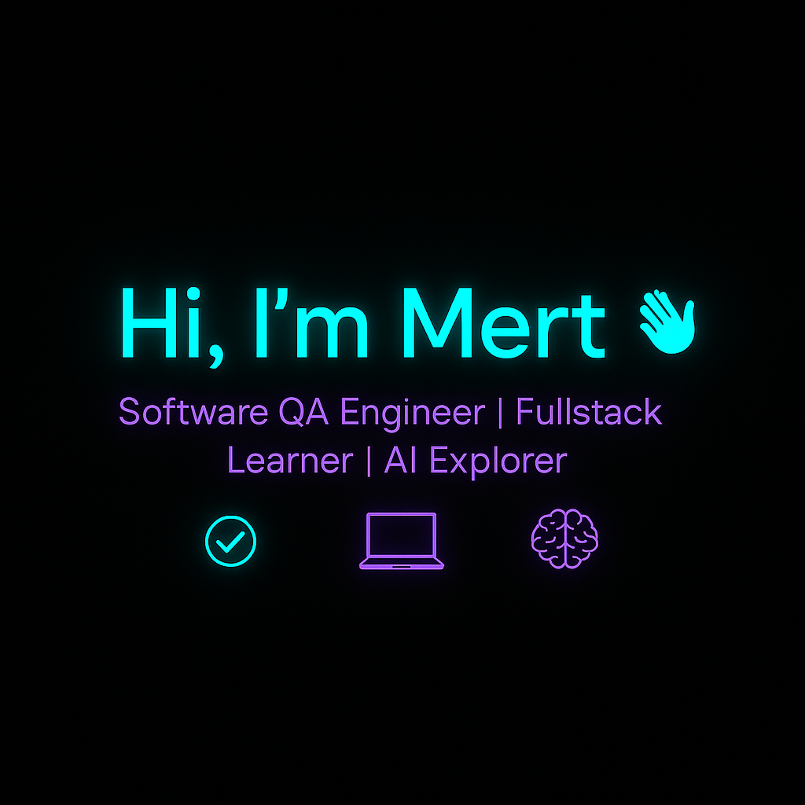

# Hi there, I'm Mert! 👋

I'm a Software QA Engineer passionate about test automation, quality assurance, and building scalable solutions. I enjoy exploring new tools, methodologies, and practices. My current focus is on QA automation, fullstack development, and leveraging AI for smarter workflows.  

---

## 👨‍💻 About Me
- **QA & Automation Enthusiast** – Experienced with web and mobile testing frameworks.  
- **Fullstack Learner** – Building hands-on applications with React, Node.js, and Supabase.  
- **AI Explorer** – Experimenting with local LLMs and workflow automation.  
- **Multilingual Collaborator** – Comfortable working across English, Turkish, and Japanese contexts.  

---

## 🚀 Projects & Interests

- **Fullstack Development** – Currently working on a sports tournament management platform with features like athlete data import, automatic categorization, match fixtures, live scoring, and referee dashboards.  
- **QA Automation** – Designing end-to-end regression tests with Cypress and Maestro, ensuring cross-platform quality.  
- **AI Workflows** – Building n8n automations that connect local LLMs (Ollama, DeepSeek, Qwen) for QA scenario generation and customer support chatbots.  
- **E-Commerce (Side Project)** – Exploring Shopify-based workflows to understand e-commerce automation and scaling challenges.  

---

## 🛠️ Technologies & Tools  

### 🌐 Frontend  
  
  
  
  
  

### ⚙️ Backend & Database  
  
  
  
  
  

### ✅ QA & Testing  
  
  
  
  

### 🔄 Automation & DevOps  
  
  
  
  
  

### 🛒 E-Commerce (Side Project)  
  
  

### 🤖 AI & LLM  
  
  
  
  
  
  

---

## 📊 GitHub Stats  

  
  
  

---

## 🌍 Let's Connect  
  
  
  

---
